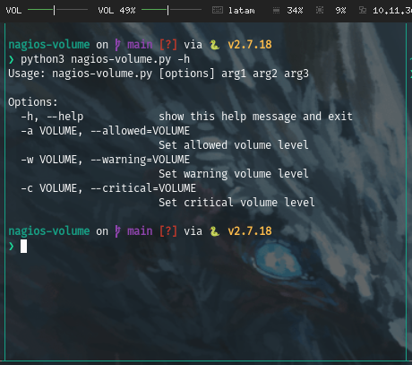
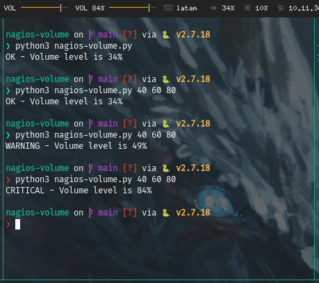

## 0 - Tested in Debian distros

**How it works:**



**How it runs:**



## 1 - Install NRPE on client

Tested in debian distros

```bash
apt-get install -y python nagios-nrpe-server useradd nrpe && update-rc.d nagios-nrpe-server defaults
```

## 2 - Copy file to Nagios plugins folder and make it executable

```bash
chmod +x /usr/lib/nagios/plugins/nagios-volume.py
```


